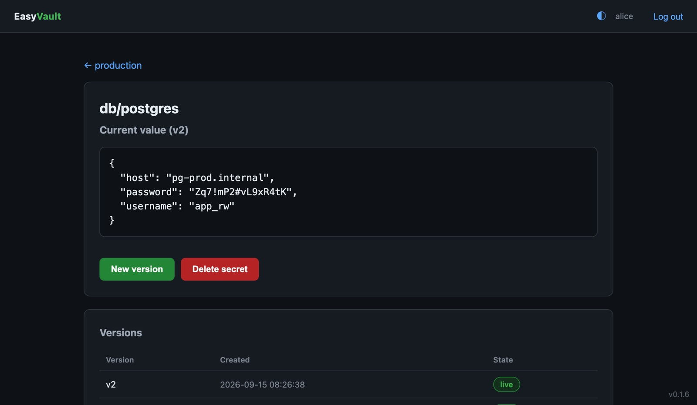

<header class="es-band es-nav">

<a href="." class="es-brand">

EasyVault
</a>
<nav class="es-nav-links" aria-label="Page sections">
<a href="#security">Security</a>
<a href="#access">Access</a>
<a href="#architecture">Architecture</a>
<a href="#install">Install</a>
<a href="install/">Docs</a>
</nav>

<a class="es-btn es-btn--secondary" href="https://github.com/easysysio/EasyVault" target="_blank" rel="noopener noreferrer">
<svg width="16" height="16" viewBox="0 0 16 16" fill="currentColor" aria-hidden="true"><path d="M8 0C3.58 0 0 3.58 0 8c0 3.54 2.29 6.53 5.47 7.59.4.07.55-.17.55-.38 0-.19-.01-.82-.01-1.49-2.01.37-2.53-.49-2.69-.94-.09-.23-.48-.94-.82-1.13-.28-.15-.68-.52-.01-.53.63-.01 1.08.58 1.23.82.72 1.21 1.87.87 2.33.66.07-.52.28-.87.51-1.07-1.78-.2-3.64-.89-3.64-3.95 0-.87.31-1.59.82-2.15-.08-.2-.36-1.02.08-2.12 0 0 .67-.21 2.2.82.64-.18 1.32-.27 2-.27.68 0 1.36.09 2 .27 1.53-1.04 2.2-.82 2.2-.82.44 1.1.16 1.92.08 2.12.51.56.82 1.27.82 2.15 0 3.07-1.87 3.75-3.65 3.95.29.25.54.73.54 1.48 0 1.07-.01 1.93-.01 2.2 0 .21.15.46.55.38A8.013 8.013 0 0016 8c0-4.42-3.58-8-8-8z"></path></svg>
GitHub
</a>
<a class="es-btn es-btn--primary" href="#install">Get started</a>

</header>
<section class="es-band es-hero">

Secrets manager · part of EasySYS

<h1 class="es-h1">Secrets your servers fetch, never store.</h1>

EasyVault keeps passwords, API keys and certificates behind envelope encryption and serves them over a HashiCorp Vault–compatible API. Services hold only a scoped, short-lived token and read what they need at runtime, so there is nothing on their disks to steal.

<a class="es-btn es-btn--primary es-btn--lg" href="#install">
Get started
<svg width="18" height="18" viewBox="0 0 24 24" fill="none" stroke="currentColor" stroke-width="2" stroke-linecap="round" stroke-linejoin="round" aria-hidden="true"><path d="M12 5v14M6 13l6 6 6-6"></path></svg>
</a>
<a class="es-btn es-btn--ghost es-btn--lg" href="install/">Read the docs</a>

<svg width="15" height="15" viewBox="0 0 24 24" fill="none" stroke="currentColor" stroke-width="2" stroke-linecap="round" stroke-linejoin="round" aria-hidden="true"><rect x="6" y="6" width="12" height="12" rx="2"></rect><path d="M9 2v4M15 2v4M9 18v4M15 18v4M2 9h4M2 15h4M18 9h4M18 15h4"></path></svg>Rust core
<svg width="15" height="15" viewBox="0 0 24 24" fill="none" stroke="currentColor" stroke-width="2" stroke-linecap="round" stroke-linejoin="round" aria-hidden="true"><path d="M21 8l-9-5-9 5v8l9 5 9-5V8z"></path><path d="M3 8l9 5 9-5M12 13v8"></path></svg>Single binary
<svg width="15" height="15" viewBox="0 0 24 24" fill="none" stroke="currentColor" stroke-width="2" stroke-linecap="round" stroke-linejoin="round" aria-hidden="true"><path d="M4 7h16M4 12h16M4 17h10"></path></svg>Vault KV v2 API
<svg width="15" height="15" viewBox="0 0 24 24" fill="none" stroke="currentColor" stroke-width="2" stroke-linecap="round" stroke-linejoin="round" aria-hidden="true"><rect x="4" y="11" width="16" height="10" rx="2"></rect><path d="M8 11V7a4 4 0 018 0v4"></path></svg>Envelope encryption

deploy@api-01 — bash

# the service reads its database password at startup
$ curl -s -H "X-Vault-Token: $VAULT_TOKEN" \
    http://vault:8200/v1/secret/data/db/postgres \
    | jq .data.data
{ "host": "pg-prod.internal",
  "username": "app_rw", "password": "••••••••" }
# decrypted for this request only, then zeroized
→ audit: READ db/postgres · 200 · HMAC-signed

API

KV v2 · :8200

Unseal

3 of 5 shares

At rest

AES-256-GCM

Packaged for

Debian / Ubuntu
RHEL / Fedora
openSUSE / SLES
Windows service
x86_64 · arm64

</section>
<section id="security" class="es-band es-security">

Security model
<h2 class="es-h2">No single stored value can decrypt anything.</h2>

Every secret is sealed under its vault's key, every vault key is wrapped per member, and the key that ties it together lives only in RAM. Steal the database and you have ciphertext.

Key hierarchy
envelope encryption

Each layer unlocks only the one below it, and only in memory.

User passwordnever stored

Argon2id → AES-256-GCM

User private keyX25519 · in memory while signed in

ECDH shared secret

Vault keyone per vault

AES-256-GCM

Secret valueversioned · never logged

<svg width="22" height="22" viewBox="0 0 24 24" fill="none" stroke="currentColor" stroke-width="1.75" stroke-linecap="round" stroke-linejoin="round" aria-hidden="true"><rect x="4" y="11" width="16" height="10" rx="2"></rect><path d="M8 11V7a4 4 0 018 0v4"></path></svg>

Master key: RAM only, Shamir-sealed

Escrows each vault key so tokens can be minted. Split into shares at init (5 shares, 3 to unseal by default), mlock-ed out of swap, and gone on every restart.

<svg width="21" height="21" viewBox="0 0 24 24" fill="none" stroke="currentColor" stroke-width="1.75" stroke-linecap="round" stroke-linejoin="round" aria-hidden="true"><path d="M2 12s3.6-7 10-7 10 7 10 7-3.6 7-10 7S2 12 2 12z"></path><path d="M3 3l18 18"></path></svg>

<h4 class="es-sec-title">A blind master</h4>

The master account creates vaults and users and escrows their keys, but can't read a single secret. Administration and access stay separate.

<svg width="21" height="21" viewBox="0 0 24 24" fill="none" stroke="currentColor" stroke-width="1.75" stroke-linecap="round" stroke-linejoin="round" aria-hidden="true"><circle cx="8" cy="15" r="4"></circle><path d="M10.8 12.2L20 3M16 7l3 3M13.5 9.5l2 2"></path></svg>

<h4 class="es-sec-title">Scoped credentials</h4>

Every token and AppRole is limited by path, client IP or CIDR and TTL, and can be issued read-only. The raw token is shown once; only its hash is kept.

<svg width="21" height="21" viewBox="0 0 24 24" fill="none" stroke="currentColor" stroke-width="1.75" stroke-linecap="round" stroke-linejoin="round" aria-hidden="true"><path d="M21 12a9 9 0 11-2.64-6.36"></path><path d="M21 3v6h-6"></path></svg>

<h4 class="es-sec-title">Rotation on revoke</h4>

Removing a member generates a new vault key, re-encrypts every secret and re-wraps it for everyone who remains, in one transaction.

<svg width="21" height="21" viewBox="0 0 24 24" fill="none" stroke="currentColor" stroke-width="1.75" stroke-linecap="round" stroke-linejoin="round" aria-hidden="true"><path d="M14 3H7a2 2 0 00-2 2v14a2 2 0 002 2h10a2 2 0 002-2V8l-5-5z"></path><path d="M14 3v5h5M9 14l2 2 4-4"></path></svg>

<h4 class="es-sec-title">Tamper-evident audit</h4>

Every read, write, denial and admin action is logged with an HMAC over the row. The audit viewer flags any entry that was edited. Values are never logged.

<svg width="21" height="21" viewBox="0 0 24 24" fill="none" stroke="currentColor" stroke-width="1.75" stroke-linecap="round" stroke-linejoin="round" aria-hidden="true"><path d="M12 22c4 0 7-3 7-7 0-3-2-5.5-3.5-7-.4 2-1.5 3-2.5 3 0-3-1-6-4-8 0 4-4 6-4 12 0 4 3 7 7 7z"></path></svg>

<h4 class="es-sec-title">Burn after read</h4>

Cap a secret at N reads. After the last one its ciphertext is wiped and the next request gets a 404 — made for one-time credentials.

<svg width="21" height="21" viewBox="0 0 24 24" fill="none" stroke="currentColor" stroke-width="1.75" stroke-linecap="round" stroke-linejoin="round" aria-hidden="true"><path d="M12 3l7 3v5c0 4.5-3 8.3-7 10-4-1.7-7-5.5-7-10V6l7-3z"></path><path d="M12 8v4M12 16h.01"></path></svg>

<h4 class="es-sec-title">Emergency seal</h4>

One button drops the master key from memory. Every token stops working and every session is locked out until the shares are presented again.

<svg width="26" height="26" viewBox="0 0 24 24" fill="none" stroke="currentColor" stroke-width="1.75" stroke-linecap="round" stroke-linejoin="round" aria-hidden="true"><circle cx="12" cy="12" r="9"></circle><path d="M12 11v5M12 8h.01"></path></svg>

A subset of Vault, and we say which subset.

No policy language and no PKI engine yet. The differences from HashiCorp Vault are listed next to the API they affect.

<a href="reference/#differences-from-hashicorp-vault">Read the differences<svg width="15" height="15" viewBox="0 0 24 24" fill="none" stroke="currentColor" stroke-width="2" stroke-linecap="round" stroke-linejoin="round" aria-hidden="true"><path d="M7 17L17 7M8 7h9v9"></path></svg></a>

</section>
<section id="access" class="es-band es-section es-subtle">

Access
<h2 class="es-h2">People in the browser. Machines over the API.</h2>

Teams manage vaults, members and secrets in the Web GUI. Services and pipelines get a credential scoped to exactly what they read, and existing Vault clients keep working.

<svg width="22" height="22" viewBox="0 0 24 24" fill="none" stroke="currentColor" stroke-width="1.75" stroke-linecap="round" stroke-linejoin="round" aria-hidden="true"><path d="M4 7h16M4 12h16M4 17h10"></path></svg>

<h3 class="ev-feature-title">Vault-compatible KV v2</h3>

Read, write, list and delete under /v1/secret with an X-Vault-Token, in Vault's own response envelope.

<svg width="22" height="22" viewBox="0 0 24 24" fill="none" stroke="currentColor" stroke-width="1.75" stroke-linecap="round" stroke-linejoin="round" aria-hidden="true"><path d="M3 12h4l3 8 4-16 3 8h4"></path></svg>

<h3 class="ev-feature-title">Every write is a version</h3>

Nothing is overwritten. The GUI shows the current value and the history behind it, and a new version is one click away.

<svg width="22" height="22" viewBox="0 0 24 24" fill="none" stroke="currentColor" stroke-width="1.75" stroke-linecap="round" stroke-linejoin="round" aria-hidden="true"><circle cx="8" cy="15" r="4"></circle><path d="M10.8 12.2L20 3M16 7l3 3M13.5 9.5l2 2"></path></svg>

<h3 class="ev-feature-title">Per-vault tokens</h3>

Allowed paths, allowed IPs, a TTL and read-only or read-write access. Renewable tokens can look up, renew and revoke themselves.

<svg width="22" height="22" viewBox="0 0 24 24" fill="none" stroke="currentColor" stroke-width="1.75" stroke-linecap="round" stroke-linejoin="round" aria-hidden="true"><rect x="3" y="4" width="18" height="16" rx="2"></rect><path d="M7 9l3 3-3 3M13 15h4"></path></svg>

<h3 class="ev-feature-title">AppRole for CI</h3>

Pipelines trade a role_id and secret_id for a short-lived token. No long-lived credential in the build config.

<svg width="22" height="22" viewBox="0 0 24 24" fill="none" stroke="currentColor" stroke-width="1.75" stroke-linecap="round" stroke-linejoin="round" aria-hidden="true"><circle cx="9" cy="8" r="4"></circle><path d="M2 21c0-3.9 3.1-7 7-7s7 3.1 7 7M17 11l2 2 4-4"></path></svg>

<h3 class="ev-feature-title">Roles per vault</h3>

Admins manage members and rotate keys, editors write secrets and issue credentials, viewers read. Access is granted vault by vault.

<svg width="22" height="22" viewBox="0 0 24 24" fill="none" stroke="currentColor" stroke-width="1.75" stroke-linecap="round" stroke-linejoin="round" aria-hidden="true"><path d="M14 3H7a2 2 0 00-2 2v14a2 2 0 002 2h10a2 2 0 002-2V8l-5-5z"></path><path d="M14 3v5h5M9 13h6M9 17h4"></path></svg>

<h3 class="ev-feature-title">Bounded audit log</h3>

Set a retention window and old events are pruned on a schedule, or immediately with Prune now. Integrity is checked on every row shown.

</section>
<section id="architecture" class="es-band es-section">

Architecture
<h2 class="es-h2">One binary between your services and their secrets</h2>

Services and pipelines authenticate with a token or an AppRole. EasyVault checks what that credential may reach, unwraps the vault key for the one request, and returns the value. Only ciphertext ever reaches the disk.

<svg viewBox="0 0 1120 440" role="img" aria-label="Diagram: apps and services send X-Vault-Token requests and CI pipelines log in with AppRole; EasyVault authenticates the credential, checks its paths, IPs and access, and unwraps the vault key with the in-memory master key; the KV v2 engine reads encrypted rows from SQLite and writes HMAC-signed audit rows; administrators use the Web GUI.">
<defs>
<marker id="ev-ah" viewBox="0 0 10 10" refX="9" refY="5" markerWidth="7" markerHeight="7" orient="auto-start-reverse"><path class="a-head" d="M0 0L10 5L0 10z"></path></marker>
<marker id="ev-ahb" viewBox="0 0 10 10" refX="9" refY="5" markerWidth="7" markerHeight="7" orient="auto-start-reverse"><path class="a-head a-head--es" d="M0 0L10 5L0 10z"></path></marker>
</defs>
<text class="a-lane" x="0" y="14">CLIENTS</text>
<text class="a-lane" x="300" y="14">EASYVAULT</text>
<text class="a-lane" x="900" y="14">KEYS &amp; STORAGE</text>
<g class="a-ext"><rect x="0" y="46" width="220" height="76" rx="10"></rect><text class="a-title" x="20" y="78">Apps &amp; services</text><text class="a-sub" x="20" y="102">X-Vault-Token</text></g>
<g class="a-ext"><rect x="0" y="182" width="220" height="76" rx="10"></rect><text class="a-title" x="20" y="214">CI &amp; automation</text><text class="a-sub" x="20" y="238">AppRole login</text></g>
<g class="a-ext"><rect x="0" y="318" width="220" height="76" rx="10"></rect><text class="a-title" x="20" y="350">Administrators</text><text class="a-sub" x="20" y="374">any browser</text></g>
<g class="a-es"><rect x="300" y="30" width="560" height="386" rx="14"></rect><text class="a-title" x="324" y="66">EasyVault</text><text class="a-sub" x="324" y="90">one binary · API and GUI on :8200</text></g>
<g class="a-box"><rect x="324" y="132" width="150" height="80" rx="10"></rect><text class="a-title" x="340" y="164">Authenticate</text><text class="a-sub" x="340" y="188">token hash</text></g>
<g class="a-box"><rect x="505" y="132" width="150" height="80" rx="10"></rect><text class="a-title" x="521" y="164">Authorize</text><text class="a-sub" x="521" y="188">paths · IPs · access</text></g>
<g class="a-box"><rect x="686" y="132" width="150" height="80" rx="10"></rect><text class="a-title" x="702" y="164">Unwrap</text><text class="a-sub" x="702" y="188">vault key</text></g>
<g class="a-box"><rect x="324" y="292" width="150" height="92" rx="10"></rect><text class="a-title" x="340" y="328">Web GUI</text><text class="a-sub" x="340" y="354">sessions · roles</text></g>
<g class="a-box"><rect x="505" y="292" width="331" height="92" rx="10"></rect><text class="a-title" x="523" y="328">KV v2 engine · audit</text><text class="a-sub" x="523" y="354">versions · burn after read · HMAC rows</text></g>
<g class="a-es"><rect x="900" y="128" width="220" height="88" rx="10"></rect><text class="a-title" x="922" y="164">Master key</text><text class="a-sub" x="922" y="190">RAM only · Shamir shares</text></g>
<g class="a-ext"><rect x="900" y="300" width="220" height="76" rx="10"></rect><text class="a-title" x="920" y="332">SQLite</text><text class="a-sub" x="920" y="356">ciphertext only</text></g>
<path class="a-line" fill="none" d="M220 84 H270 V158 H322" marker-end="url(#ev-ah)"></path>
<text class="a-label" x="226" y="76">HTTP</text>
<path class="a-line" fill="none" d="M220 220 H270 V172 H322" marker-end="url(#ev-ah)"></path>
<text class="a-label" x="226" y="212">AppRole</text>
<line class="a-line" x1="220" y1="338" x2="322" y2="338" marker-end="url(#ev-ah)"></line>
<text class="a-label" x="226" y="328">HTTP</text>
<line class="a-line a-line--es" x1="474" y1="172" x2="503" y2="172" marker-end="url(#ev-ahb)"></line>
<line class="a-line a-line--es" x1="655" y1="172" x2="684" y2="172" marker-end="url(#ev-ahb)"></line>
<line class="a-line" x1="399" y1="292" x2="399" y2="214" marker-end="url(#ev-ah)"></line>
<line class="a-line a-line--es" x1="898" y1="172" x2="838" y2="172" marker-end="url(#ev-ahb)"></line>
<text class="a-label a-label--es" x="868" y="162" text-anchor="middle">escrow</text>
<line class="a-line a-line--es" x1="761" y1="212" x2="761" y2="290" marker-end="url(#ev-ahb)"></line>
<text class="a-label a-label--es" x="773" y="256">decrypt</text>
<line class="a-line a-line--es" x1="836" y1="338" x2="898" y2="338" marker-end="url(#ev-ahb)"></line>
<text class="a-label" x="867" y="328" text-anchor="middle">rows</text>
</svg>

EasySYS service
Your existing infrastructure
The master key never touches the disk; after a restart it is rebuilt from the unseal shares.

</section>
<section id="install" class="es-band es-section es-subtle">

Deploy
<h2 class="es-h2">Running in minutes. Upgraded like everything else.</h2>

EasyVault installs from the signed EasySYS package repository as a hardened service, and upgrades through the package manager you already use. The <a href="install/">installation guide</a> has the details.

1

Add the signed repository

Signed apt, yum and zypper channels for x86_64 and arm64, or the Windows installer.

2

Install the service

It starts on boot, listens on port 8200 and comes up sealed.

3

Initialize, unseal, sign in

Save the unseal shares, unseal with the threshold, and create the master account.

<input class="es-os-radio" type="radio" name="es-os" id="es-os-deb" checked />
<input class="es-os-radio" type="radio" name="es-os" id="es-os-rpm" />
<input class="es-os-radio" type="radio" name="es-os" id="es-os-suse" />
<input class="es-os-radio" type="radio" name="es-os" id="es-os-air" />

<label for="es-os-deb">Debian / Ubuntu</label>
<label for="es-os-rpm">RHEL / Fedora</label>
<label for="es-os-suse">openSUSE / SLES</label>
<label for="es-os-air">Windows</label>

# 1 — trust the repository
$ curl -fsSL https://repo.easysys.io/easyvault/stable/debian/key.gpg \
    | sudo gpg --dearmor -o /usr/share/keyrings/easysys.gpg
$ echo "deb [signed-by=/usr/share/keyrings/easysys.gpg] \
    https://repo.easysys.io/easyvault/stable/debian ./" \
    | sudo tee /etc/apt/sources.list.d/easyvault.list
# 2 — install; the service starts sealed
$ sudo apt update &amp;&amp; sudo apt install easyvault
# 3 — initialize and unseal
→ http://&lt;host&gt;:8200/

# 1 — trust the repository
$ sudo tee /etc/yum.repos.d/easyvault.repo &gt;/dev/null &lt;&lt;'EOF'
[easyvault]
name=EasyVault
baseurl=https://repo.easysys.io/easyvault/stable/redhat
enabled=1
gpgcheck=1
gpgkey=https://repo.easysys.io/easyvault/stable/redhat/key.gpg
EOF
# 2 — install; the service starts sealed
$ sudo dnf install easyvault
# 3 — initialize and unseal
→ http://&lt;host&gt;:8200/

# 1 — trust the repository
$ sudo zypper addrepo -fg \
    https://repo.easysys.io/easyvault/stable/redhat easyvault
# 2 — install; the service starts sealed
$ sudo zypper install easyvault
# 3 — initialize and unseal
→ http://&lt;host&gt;:8200/

# 1 — download the installer
#     repo.easysys.io/easyvault/stable/windows
# 2 — run it; the EasyVault service starts
#     automatically and restarts on failure
&gt; easyvault-&lt;version&gt;-x86_64.exe
# data, certs and config live in
#     %ProgramData%\EasyVault
# 3 — initialize and unseal
→ http://localhost:8200/

</section>
<section class="es-band es-cta">

<svg class="es-cta-hex" viewBox="0 0 512 512" aria-hidden="true"><polygon points="86,256 171,109 341,109 426,256 341,403 171,403" fill="none" stroke="#ffffff" stroke-width="34" stroke-linejoin="round"></polygon></svg>

<h2 class="es-h2">Start with one vault.</h2>

Move one service's credentials into EasyVault and give it a read-only token. MIT licensed and developed in the open.

<a class="es-btn es-btn--primary es-btn--lg" href="install/">Read the docs</a>
<a class="es-btn es-btn--on-dark es-btn--lg" href="https://github.com/easysysio/EasyVault" target="_blank" rel="noopener noreferrer">GitHub</a>

</section>
<footer class="es-band es-footer">

<a href="." class="es-brand">EasyVault</a>

A self-hosted, Vault-compatible secrets manager. Part of the <a href="https://easysys.io">EasySYS</a> suite.

Documentation
<a href="install/">Installation</a>
<a href="unseal/">Initialize &amp; unseal</a>
<a href="security/">Security model</a>
<a href="secrets/">Secrets &amp; access</a>
<a href="operations/">Operations</a>
<a href="reference/">API reference</a>

EasySYS
<a href="https://easysys.io">easysys.io</a>
<a href="https://easywaf.easysys.io">EasyWAF</a>
<a href="https://easylog.easysys.io">EasyLog</a>
<a href="https://easydc.easysys.io">EasyDC</a>
<a href="https://www.easynas.org">EasyNAS</a>

Community
<a href="https://github.com/easysysio/EasyVault">GitHub</a>
<a href="https://github.com/easysysio/EasyVault/releases">Releases</a>
<a href="https://repo.easysys.io">Package repository</a>
<a href="https://discord.gg/easysys">Discord</a>

© 2026 EasySYS · MIT licensed
easyvault.easysys.io

</footer>

