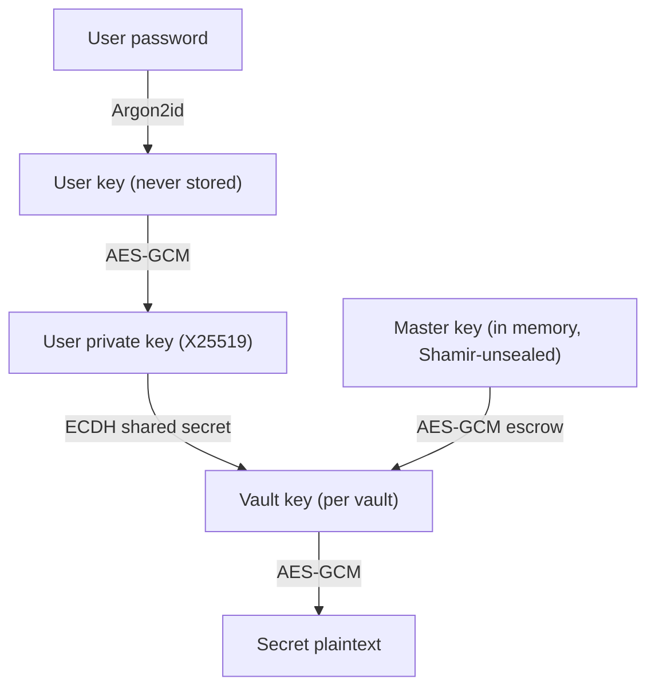

# EasyVault

**A self-hosted, HashiCorp Vault–compatible secrets manager with envelope encryption at its core.**

EasyVault stores and serves passwords, API keys, certificates, and configuration secrets. It speaks a Vault-compatible REST API, so existing scripts, apps, and CI systems can read secrets with little or no change. Secrets never touch client storage — services hold only a short-lived API token and fetch secrets at runtime.

!!! info "Server only — no CLI, no agent"
    EasyVault is **managed entirely through its Web GUI or REST API**. There is no command-line tool and no client agent to install. Everything below — initializing, unsealing, creating vaults, issuing tokens — happens in the browser at `http://your-host:8200` or over HTTP.

---

## Security model

Every secret is sealed with **envelope encryption**, and keys are layered so that no single stored value can decrypt anything on its own.

- **Per-vault keys** — each vault has its own random AES-256-GCM key. Secret values are encrypted with it.
- **Per-user distribution (X25519 ECDH)** — a vault key is never stored in the clear. It is wrapped individually for each member using an elliptic-curve shared secret derived from their key pair, which is itself unlocked by their password (Argon2id). A user’s private key is decrypted only in memory, only while they are logged in.
- **Master key (Shamir-sealed)** — a separate in-memory master key escrows each vault key, enabling token minting and administrative assignment. It is held only in RAM (memory-locked on Linux) and is reconstructed from Shamir shares at unseal.



!!! success "What this buys you"
    * Secret values are **never logged** and never written unencrypted.
    * The database at rest reveals nothing without the master key.
    * Memory-safe Rust core — no buffer overflows, leaks, or use-after-free.
    * All key material is zeroized after use; the master key is `mlock`-ed out of swap.

---

## Roles

EasyVault separates *administration* from *secret access*.

| Role | Scope | Can do |
|---|---|---|
| **Master** | Global | Create vaults & users, assign users to vaults — but **cannot read any secret** (separation of duties). |
| **Vault admin** | Per vault | Read/write secrets, create tokens & AppRoles, assign users to that vault. |
| **Vault editor** | Per vault | Read/write secrets, create tokens & AppRoles. |
| **Vault viewer** | Per vault | Read secrets. |

The master account is deliberately **blind** to secret contents: it generates and escrows vault keys but never holds a readable copy.

---

## Initialize & unseal

On startup EasyVault is **sealed** — the database is present but the master key is not in memory, so nothing can be decrypted. This happens on **every restart** (the same model as HashiCorp Vault); after a reboot you unseal again.

=== "In the browser"

    Open `http://your-host:8200`. A fresh instance walks you through it:

    1. **Initialize** — choose the number of key shares and the threshold (default **5 shares, 3 required**). The shares are shown **once** — save them somewhere safe.
    2. **Unseal** — paste shares one at a time until the threshold is met.
    3. **Create the master account**, then sign in.

=== "Over the REST API"

    ```bash
    # Initialize once — returns the unseal shares (save them!)
    curl -X POST http://your-host:8200/v1/sys/init \
      -H 'Content-Type: application/json' \
      -d '{"secret_shares":5,"secret_threshold":3}'

    # Unseal after every restart — one call per share, until threshold is reached
    curl -X POST http://your-host:8200/v1/sys/unseal \
      -H 'Content-Type: application/json' -d '{"key":"<share-1>"}'
    curl -X POST http://your-host:8200/v1/sys/unseal \
      -H 'Content-Type: application/json' -d '{"key":"<share-2>"}'
    curl -X POST http://your-host:8200/v1/sys/unseal \
      -H 'Content-Type: application/json' -d '{"key":"<share-3>"}'

    # Check status
    curl http://your-host:8200/v1/sys/seal-status
    ```

!!! warning "Keep your unseal shares safe"
    The shares are shown only at init. Lose more than `shares − threshold` of them and the data is **unrecoverable**; anyone with `threshold` of them can unseal the instance. A master operator can re-seal at any time from the dashboard (emergency lockdown).

---

## Storing & reading secrets

Create a vault, assign members with a role, then store secrets — all in the GUI. Secrets are **versioned**: every write is a new version, and history is preserved.

Machines read secrets over the Vault-compatible **KV v2** API using an `X-Vault-Token`:

```bash
curl -H "X-Vault-Token: ev.x5H9jLK8yN27p..." \
     http://your-host:8200/v1/secret/data/db/postgres
```

```json
{
  "request_id": "8432a13f-b3b4-e4c1-4cfa-298a72b0c39f",
  "data": {
    "data": { "username": "prod_db_user", "password": "S3cur3Pass!" },
    "metadata": { "version": 2, "destroyed": false }
  }
}
```

Write a new version, or list a path:

```bash
# Write
curl -X POST -H "X-Vault-Token: ev.x5H9..." \
     http://your-host:8200/v1/secret/data/db/postgres \
     -d '{"data":{"username":"prod_db_user","password":"S3cur3Pass!"}}'

# List keys under a prefix
curl -H "X-Vault-Token: ev.x5H9..." \
     "http://your-host:8200/v1/secret/metadata/db?list=true"
```

---

## Machine access

### API tokens

Editors and admins mint **per-vault** tokens in the GUI (`Vault → Tokens`). Each token is scoped by:

- **Allowed paths** — `*`, prefix globs like `db/*`, or exact paths.
- **Allowed IPs / CIDRs** — where the token may be used from (per-token network ACL).
- **TTL** — optional expiry; tokens with a TTL are **renewable**.

The raw token (prefix `ev.`) is shown once. Clients can manage their own token:

```bash
curl -H "X-Vault-Token: ev.x5H9..." http://your-host:8200/v1/auth/token/lookup-self
curl -X POST -H "X-Vault-Token: ev.x5H9..." http://your-host:8200/v1/auth/token/renew-self
curl -X POST -H "X-Vault-Token: ev.x5H9..." http://your-host:8200/v1/auth/token/revoke-self
```

### AppRole (CI / automation)

For unattended workloads, define an **AppRole** on a vault (`Vault → AppRoles`). A service then exchanges its `role_id` + `secret_id` for a scoped token:

```bash
curl -X POST http://your-host:8200/v1/auth/approle/login \
  -d '{"role_id":"4ab67f03-...","secret_id":"IAIE2fgV..."}'
```

```json
{ "auth": { "client_token": "ev.LFRxvc...", "policies": ["db/*"], "lease_duration": 3600, "renewable": true } }
```

Revoking a member (or rotating a vault key) re-encrypts the vault’s secrets and re-wraps every member and live token — so a removed credential can’t decrypt future reads.

---

## Operations

- **TLS** — set `tls = true` in the config to serve HTTPS; a self-signed certificate (localhost, 127.0.0.1) is generated on first run and reused, or supply your own PEM files.
- **Tamper-evident audit log** — every secret read/write and admin action is recorded with an HMAC over the row (keyed by the master key). The master-only audit viewer flags any tampered entry. Secret values are never logged.
- **Per-token IP / subnet ACLs** — restrict which client IPs may use a given token or AppRole, with `X-Forwarded-For` support behind a trusted proxy.
- **Key rotation** — rotate a vault key on demand or automatically on member revocation.

---

## Getting started

EasyVault ships as a single binary and installs a background **service** that starts on boot. Install it from the EasySYS package repository so upgrades come through your package manager.

=== "Debian / Ubuntu"

    ```bash
    # Add the EasyVault repository (signed)
    curl -fsSL https://repo.easysys.io/easyvault/stable/debian/key.gpg \
      | sudo gpg --dearmor -o /usr/share/keyrings/easysys.gpg
    echo "deb [signed-by=/usr/share/keyrings/easysys.gpg] https://repo.easysys.io/easyvault/stable/debian ./" \
      | sudo tee /etc/apt/sources.list.d/easyvault.list

    sudo apt update
    sudo apt install easyvault
    systemctl status easyvault          # listens on :8200, starts sealed
    ```

=== "RHEL / Fedora"

    ```bash
    sudo tee /etc/yum.repos.d/easyvault.repo >/dev/null <<'EOF'
    [easyvault]
    name=EasyVault
    baseurl=https://repo.easysys.io/easyvault/stable/redhat
    enabled=1
    gpgcheck=1
    gpgkey=https://repo.easysys.io/easyvault/stable/redhat/key.gpg
    EOF

    sudo dnf install easyvault
    systemctl status easyvault
    ```

=== "openSUSE / SLES"

    ```bash
    sudo zypper addrepo -fg https://repo.easysys.io/easyvault/stable/redhat easyvault
    sudo zypper install easyvault
    systemctl status easyvault
    ```

=== "Windows"

    Download and run the installer from
    **[https://repo.easysys.io/easyvault/stable/windows](https://repo.easysys.io/easyvault/stable/windows)**.
    It registers the **EasyVault** Windows service (Automatic start) and stores
    data under `%ProgramData%\EasyVault`. Open the dashboard from the Start menu.

After install, open `http://your-host:8200`, **initialize** (save your shares), **unseal**, and create the master account. On Linux the database, TLS certs, and config live under `/var/lib/easyvault` and `/etc/easyvault`; the service runs as a dedicated `easyvault` user with the master key locked into RAM.

!!! note "Roadmap"
    A named **policy engine**, **PKI** (CA + cert issuance), and **dynamic database credentials** are planned. The KV secrets engine, per-vault tokens, AppRole, and token self-management are available today.
