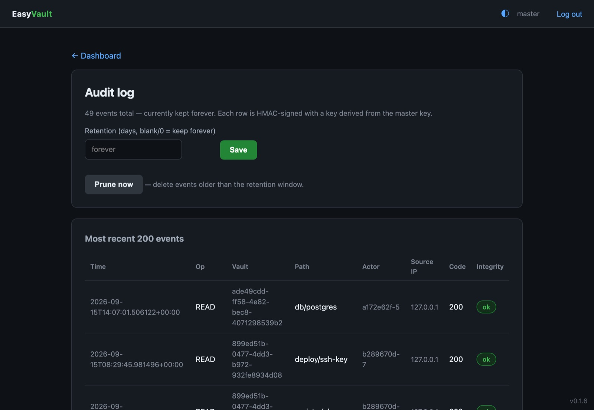
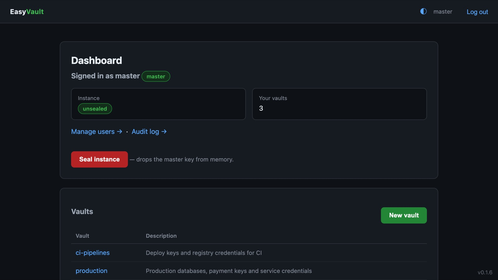

# Operations

## Configuration

EasyVault reads `config.toml` — `/etc/easyvault/config.toml` for the Linux
service, `%ProgramData%\EasyVault\config.toml` on Windows. Set
`EASYVAULT_CONFIG` to point somewhere else. Restart the service after editing
it (and unseal again).

```toml
[server]
address = "0.0.0.0"
port = 8200                        # match HashiCorp Vault default
tls = false                        # set true to serve HTTPS
tls_cert = ""                      # empty (with tls = true) = self-signed
tls_key = ""

[storage]
type = "sqlite"                    # SQLite is the only backend
path = "easyvault.db"              # relative paths live in the data directory

[security]
session_ttl_hours = 8              # GUI session lifetime
max_login_attempts = 5             # failed sign-ins before a lockout
lockout_minutes = 15
trusted_proxies = ["127.0.0.1"]    # honoured for X-Forwarded-For

[audit]
enabled = true
log_raw_values = false             # NEVER set to true in production
easylog_url = ""

[init]
default_key_shares = 5
default_key_threshold = 3
```

!!! note "The `[audit]` block is reserved"
    It is parsed so existing config files keep working, but not enforced yet:
    the audit log is always on, secret values are never logged, and the
    EasyLog sink is not available yet.

## TLS

Set `tls = true` to serve HTTPS. With `tls_cert` and `tls_key` empty, a
self-signed certificate for `localhost` / `127.0.0.1` is generated on first run
under the data directory and reused afterwards. For production, point both at
your own PEM files — or terminate TLS at a reverse proxy.

## Behind a reverse proxy

EasyVault takes the client address from `X-Forwarded-For` **only** when the
request comes from an address listed in `trusted_proxies`; otherwise it uses the
connecting peer. List your proxy (Traefik, Nginx, …) there so that token IP
restrictions, sign-in lockouts and the audit log see real client addresses.

## Users

The master creates accounts on the **Users** page and can **disable** or
**enable** them. A disabled user can't sign in and their open sessions are
dropped immediately; master accounts can't be disabled. Every user can change
their own password from their account page — see
[Passwords](security.md#passwords) for why the master can't reset one.

After `max_login_attempts` failed sign-ins, further attempts are locked out for
`lockout_minutes`.

## Audit log

<figure markdown="span">
  { loading=lazy }
  <figcaption>Reads, writes and denials with actor, client address and result; the Integrity column checks each row's HMAC.</figcaption>
</figure>

The master's **Audit** page lists every secret read and write (including
denials) and every administrative action, with its path, actor, client address
and result. Each row carries an HMAC, and the **Integrity** column flags any row
that was altered in the database.

To keep the log bounded, set a **retention window** in days on the same page (0
or blank keeps everything). Older entries are pruned at startup and every six
hours, or straight away with **Prune now**.

## Key rotation

A vault admin can **rotate** a vault's key from its **Settings** page; revoking a
member rotates it automatically. Rotation re-encrypts every secret version and
re-wraps the key for every member and live token in one transaction, so clients
keep working without being reissued credentials.

## Emergency seal

<figure markdown="span">
  { loading=lazy }
  <figcaption>The master's dashboard: instance state, vaults, and the Seal instance button.</figcaption>
</figure>

**Seal instance** on the master's dashboard drops the master key from memory
at once. Every API token stops working and all users are locked out until the
instance is [unsealed](unseal.md) with the shares again.

## Service and logs

=== "Linux"

    ```bash
    systemctl status easyvault
    sudo systemctl restart easyvault      # comes back sealed
    tail -f /var/log/easyvault/easyvault.log /var/log/easyvault/easyvault_error.log
    ```

=== "Windows"

    The **EasyVault** service is managed from `services.msc` like any other; it
    restarts itself on failure. Logs are written to
    `%ProgramData%\EasyVault\logs`.
