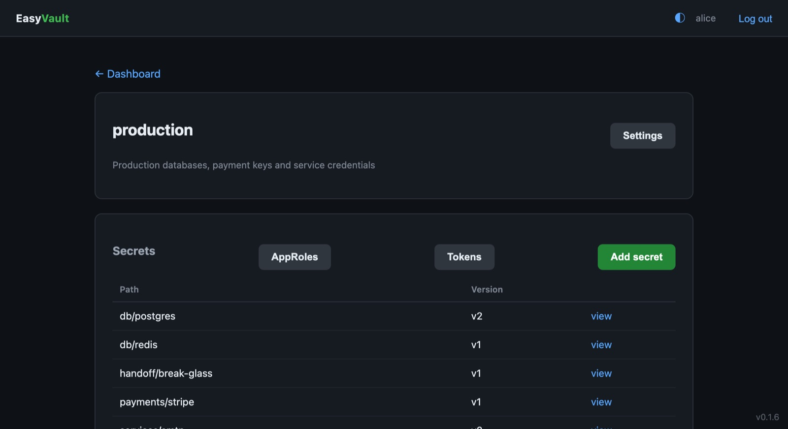
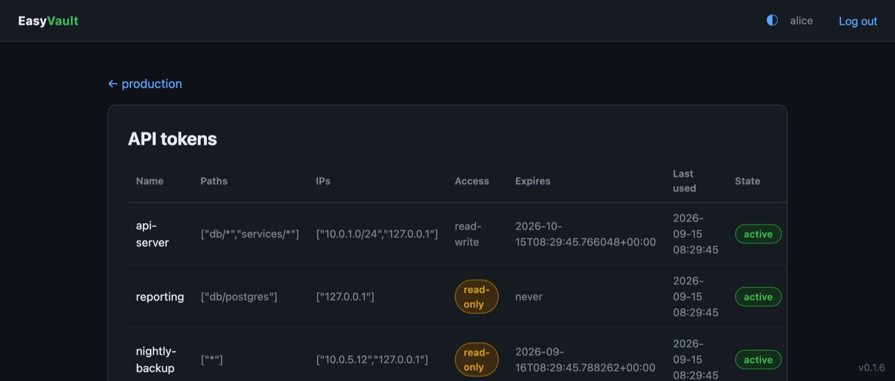
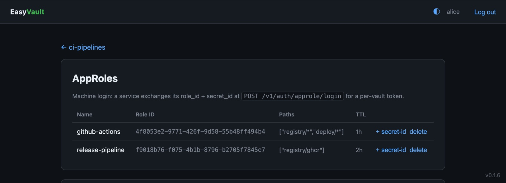

# Secrets & access

People manage vaults and secrets in the Web GUI. Machines read them over the
Vault-compatible **KV v2** REST API with a scoped token.

## Vaults and members

The **master** creates a vault, then assigns users to it with a
[role](security.md#roles) — admin, editor or viewer — from the vault's
**Settings** page. Vault admins can manage members from there too.

## Storing secrets

<figure markdown="span">
  { loading=lazy }
  <figcaption>A vault's secrets, with the latest version of each path.</figcaption>
</figure>

Open a vault and add a secret: a **path** (for example `db/postgres`) and a JSON
object of key/value pairs. Secrets are **versioned** — every write creates a new
version and history is preserved.

**Delete secret** in the GUI removes the whole secret, all versions, after a
confirmation; writing the same path again starts a fresh version.

### Burn after read

A secret can cap how many times it may be fetched over the API. Set **Max
reads** when writing it, or pass `options.max_reads` to the API. After the Nth
read the version is **destroyed and its ciphertext wiped**, and the next fetch
returns 404. Read responses include `metadata.reads_remaining`. Viewing the
secret in the GUI does not use up a read. Useful for one-time credentials.

## Reading and writing over the API

Clients send their token in the `X-Vault-Token` header:

```bash
curl -H "X-Vault-Token: ev.x5H9jLK8yN27p..." \
     http://<host>:8200/v1/secret/data/db/postgres
```

```json
{
  "request_id": "8432a13f-b3b4-e4c1-4cfa-298a72b0c39f",
  "data": {
    "data": { "username": "prod_db_user", "password": "S3cur3Pass!" },
    "metadata": { "version": 2, "destroyed": false }
  }
}
```

Write a new version, or list a path:

```bash
# Write
curl -X POST -H "X-Vault-Token: ev.x5H9..." \
     -H 'Content-Type: application/json' \
     http://<host>:8200/v1/secret/data/db/postgres \
     -d '{"data":{"username":"prod_db_user","password":"S3cur3Pass!"}}'

# Write a single-use secret
curl -X POST -H "X-Vault-Token: ev.x5H9..." \
     -H 'Content-Type: application/json' \
     http://<host>:8200/v1/secret/data/handoff/otp \
     -d '{"data":{"code":"493021"},"options":{"max_reads":1}}'

# List keys under a prefix — note the trailing slash
curl -H "X-Vault-Token: ev.x5H9..." \
     "http://<host>:8200/v1/secret/metadata/db/?list=true"
```

A token limited to `db/*` can list `metadata/db/` but not `metadata/db`, which
doesn't fall under its `db/` prefix; a `*` token can list either, and the root.

`DELETE /v1/secret/data/<path>` soft-deletes the latest version, as in Vault.

## API tokens

Editors and admins mint **per-vault** tokens in the GUI (**Vault → Tokens**).

<figure markdown="span">
  { loading=lazy }
  <figcaption>Tokens with their allowed paths and IPs, access mode, expiry and last use.</figcaption>
</figure>

Each token is scoped by:

- **Allowed paths** — one per line: `*`, prefix globs like `db/*`, or exact paths.
- **Allowed IPs / CIDRs** — one per line: where the token may be used from.
  Leave it blank to allow any address.
- **TTL** — optional expiry; tokens with a TTL are **renewable**.
- **Access** — **read-write**, or **read-only**: a read-only token can fetch
  secrets but gets `403` on any write or delete.

The raw token (prefix `ev.`) is shown once. Clients can manage their own token:

```bash
curl -H "X-Vault-Token: ev.x5H9..." http://<host>:8200/v1/auth/token/lookup-self
curl -X POST -H "X-Vault-Token: ev.x5H9..." http://<host>:8200/v1/auth/token/renew-self
curl -X POST -H "X-Vault-Token: ev.x5H9..." http://<host>:8200/v1/auth/token/revoke-self
```

Revoking a token in the GUI takes effect immediately.

## AppRole (CI / automation)

For unattended workloads, define an **AppRole** on a vault (**Vault →
AppRoles**) with the same path, IP, TTL and access limits as a token.

<figure markdown="span">
  { loading=lazy }
  <figcaption>AppRoles for a CI vault, each with its role ID, allowed paths and token TTL.</figcaption>
</figure>
 Issue a
`secret_id` for it — shown once, together with a ready-to-run login command. A
service then exchanges its `role_id` + `secret_id` for a scoped token:

```bash
curl -X POST http://<host>:8200/v1/auth/approle/login \
  -H 'Content-Type: application/json' \
  -d '{"role_id":"4ab67f03-...","secret_id":"IAIE2fgV..."}'
```

```json
{ "auth": { "client_token": "ev.LFRxvc...", "policies": ["db/*"], "lease_duration": 3600, "renewable": true } }
```

`policies` lists the role's allowed paths. Only a hash of each `secret_id` is
stored, and deleting the role stops new logins.
