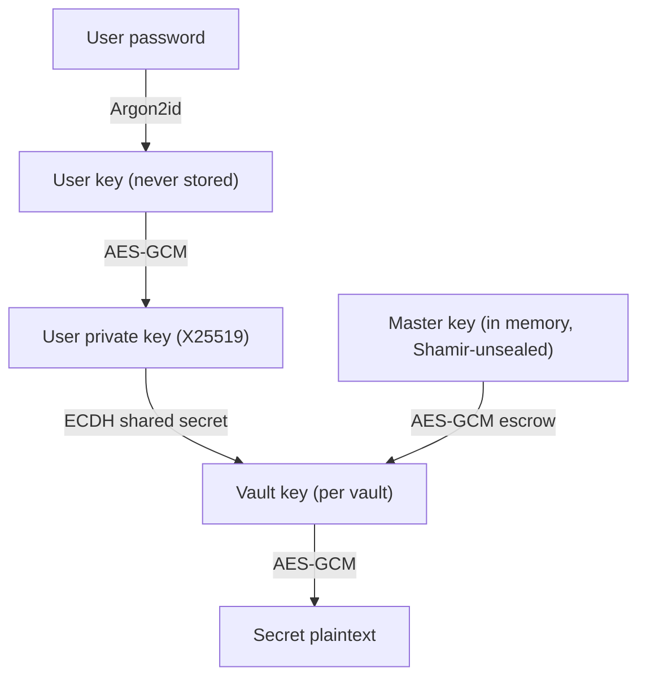

# Security model

Every secret is sealed with **envelope encryption**, and keys are layered so
that no single stored value can decrypt anything on its own.

- **Per-vault keys** — each vault has its own random AES-256-GCM key. Secret
  values are encrypted with it.
- **Per-user distribution (X25519 ECDH)** — a vault key is never stored in the
  clear. It is wrapped individually for each member using an elliptic-curve
  shared secret derived from their key pair, which is itself unlocked by their
  password (Argon2id). A user's private key is decrypted only in memory, only
  while they are signed in.
- **Master key (Shamir-sealed)** — a separate in-memory master key escrows each
  vault key, enabling token minting and administrative assignment. It is held
  only in RAM, locked out of swap where the OS allows it, and reconstructed from
  Shamir shares at [unseal](unseal.md).

!!! success "What this buys you"
    * Secret values are **never logged** and never written unencrypted.
    * The database at rest reveals nothing without the master key.
    * Memory-safe Rust core — no buffer overflows, leaks, or use-after-free.
    * All key material is zeroized after use; the master key is `mlock`-ed out of swap.

## How machines get at a vault key

API tokens never see a user's password or private key. When a token is created,
EasyVault generates a random **token key**, wraps the vault key under it, and
wraps the token key under the master key. The raw token is returned once and
only its SHA-256 hash is stored.

On each request EasyVault hashes the presented token, checks it is not revoked
or expired and that the path and client IP are allowed, then unwraps
*token key → vault key → secret* for that request only and zeroizes the keys
afterwards. Because the master key is part of that chain, **a sealed instance
serves nothing**.

## Roles

EasyVault separates *administration* from *secret access*.

| Role | Scope | Can do |
|---|---|---|
| **Master** | Global | Create vaults & users, assign users to vaults, view the audit log, seal the instance — but **cannot read any secret** (separation of duties). |
| **Vault admin** | Per vault | Read/write secrets, create tokens & AppRoles, manage the vault's members and rotate its key. |
| **Vault editor** | Per vault | Read/write secrets, create tokens & AppRoles. |
| **Vault viewer** | Per vault | Read secrets. |

The master account is deliberately **blind** to secret contents: it generates
and escrows vault keys but never holds a readable copy.

## Revocation and rotation

Revoking a member's access **rotates the vault key**: EasyVault generates a new
key, re-encrypts every stored secret version, and re-wraps the key for the
master escrow, each remaining member and each live token, in one transaction. A
removed credential therefore can't decrypt anything written or re-encrypted
afterwards. Vault admins can also rotate a key on demand from the vault's
Settings page.

## Passwords

Changing your password re-wraps your private key under a key derived from the
new password; your vault access is preserved, because vault keys are wrapped
with ECDH shared secrets rather than with the password. For the same reason the
**master cannot reset another user's password** — there is no copy of their
private key to re-wrap. A user who loses their password needs a new account,
granted access to the vaults again.

## Audit trail

Every secret read and write, every denial, and every administrative action is
recorded with the path, the actor, the client address and the result — never
the secret value. Each row carries an **HMAC-SHA256** keyed from the master key,
and the master's audit viewer flags any row that has been altered. See
[Operations](operations.md#audit-log).
